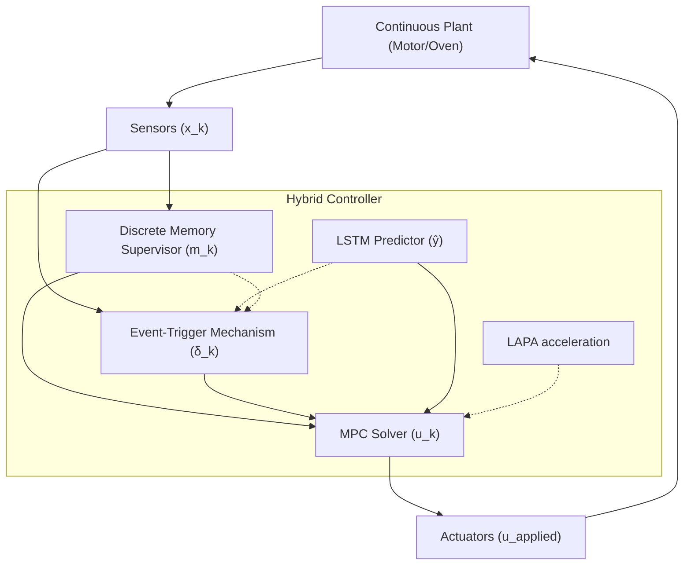

# Paper Sections Draft: Methodology and Experimental Setup

## 3. Methodology: Event-Driven Hybrid Control with Discrete Memory

We propose a novel hybrid control architecture that integrates **high-level discrete supervision** with **low-level event-triggered predictive control**. The core contribution is the "Risk-Aware Discrete Memory" (RADM), which allows the system to sustain safe operational modes even when instantaneous trigger conditions oscillate.

### 3.1 System Architecture

The interaction between the continuous plant and the discrete components is summarized in the following architecture:

### 3.2 System Modeling

We consider discrete-time systems represented by:
$$ x_{k+1} = f(x_k, u_k) + d_k $$
where $x_k \in \mathbb{R}^n$, $u_k \in \mathbb{R}^m$, and $d_k$ is a stochastic disturbance. For our experimental validation, we employ:

1.  **DC Motor (LTI)**: 
    $$ \begin{bmatrix} \theta_{k+1} \\ \omega_{k+1} \end{bmatrix} = \begin{bmatrix} 1 & T_s \\ 0 & 1 - \frac{T_s b}{J} \end{bmatrix} \begin{bmatrix} \theta_k \\ \omega_k \end{bmatrix} + \begin{bmatrix} 0 \\ \frac{T_s}{J} \end{bmatrix} \text{sat}(u_k) $$
    where $b$ is friction and $J$ inertia.
2.  **Thermal Oven (Nonlinear + Delay)**: 
    $$ T_{ch, k+1} = (1 - \alpha T_s) T_{ch, k} + \alpha T_s \left( h_{scale} \frac{u_{k-\tau_d}}{T_{max}} \right) $$
    where $\tau_d$ represents transport delay.

### 3.3 Hybrid State and Discrete Memory Supervisor

The system state is augmented with a discrete memory vector $m_k \in \{0,1\}^3$. This vector acts as a logic supervisor that classifies the operational regime into three binary states:

- **$m^{\text{nom}}$ (Nominal)**: Active during stable tracking.
- **$m^{\text{sat}}$ (Saturated)**: Active when the actuator is pinned at its limit $|u| = u_{\max}$. We apply a debouncing filter to avoid spurious mode switching.
- **$m^{\text{crit}}$ (Critical)**: Active when the system is near a constraint boundary or the risk metric $E_{\text{risk}}$ exceeds a safety threshold.

The transition logic follows an SR-Latch structure with hysteresis:
- **Set Critical**: $\text{dist}(x_k, \partial \mathcal{X}) < \epsilon \lor E_{\text{risk}} > \eta_{\text{crit}}$
- **Reset Critical**: $E_{\text{risk}} < \eta_{\text{safe}} \land \|x - r\| < \epsilon_r$ (after $T_{dwell}$ steps).

### 3.4 Adaptive Event-Trigger Mechanism (ETM)

The control update law is defined as:
$$ u_k = \begin{cases} \text{MPC}(x_k, m_k) & \text{if } \delta_k = 1 \\ u_{k-1} & \text{otherwise} \end{cases} $$
The trigger $\delta_k = \mathbb{1}(E_k > \eta(m_k))$ depends on the memory state. The proposed **E-Risk** function is defined as:
$$ E_{\text{risk}} = -\min_{i}(c_i(x_k, u_k)) + \lambda \frac{\|x_k - \hat{y}_{k|k-1}\|}{\sigma_{pred}} $$
This formulation prioritizes safety by triggering updates when constraint margins shrink, even if the tracking error is small.

### 3.5 Model Predictive Control with LAPA acceleration

The MPC solves the following optimization problem at each event $k$:
$$ \min_{U} \sum_{j=1}^{N_k} \|x_{k+j} - r_{k+j}\|_Q^2 + \|u_{k+j-1}\|_R^2 $$
$$ \text{s.t. } x_{t+1} = f(x_t, u_t), \quad x_t \in \mathcal{X}, \quad u_t \in \mathcal{U} $$

**LAPA acceleration (LAPA)** consists of:
1.  **LAPA-A (Neural Warm-Start)**: An LSTM network predicts $U_{init}$ from $H_k = \{x_{t}, u_{t}\}_{t=k-H}^k$. This reduces IPOPT iterations by providing a high-quality initial guess.
2.  **LAPA-B (Predictive Horizon Adaptation)**: $N_k = N_{base}$ if $m^{\text{nom}}=1$, and $N_k = N_{long}$ if $m^{\text{crit}}=1$, concentrating computational resources when safety is at risk.

---

## 4. Experimental Setup

### 4.1 Comparative Baselines

| Baseline | Strategy | Scientific Purpose |
| :--- | :--- | :--- |
| **B1: Periodic** | $\delta_k=1, \forall k$ | Performance upper bound. |
| **B2: Classic E-MPC** | Fixed $\eta$, No Logic | Measure gain from adaptive thresholds. |
| **B3: RL-Policy** | Direct $\pi(x)$ mapping | Compare optimization vs heuristic. |

### 4.2 Proposed Ablations

- **A1 (No-Memory)**: Measures the impact of the "Dwell-time" logic in stabilizing event rates.
- **A2 (No-LAPA)**: Quantifies CPU savings from neural warm-starts.
- **A4 (Event-MPC)**: Standard PETC baseline using the E-Risk function without hybrid logic.

### 4.3 Statistical Protocol

Evaluation is conducted over **15 random seeds** and **25 stochastic scenarios** (load perturbations, reference jumps, and sensor noise). Metrics include Tracking Cost ($J$), Violation Count ($N_v$), and 95th percentile CPU time ($P_{95}$).
